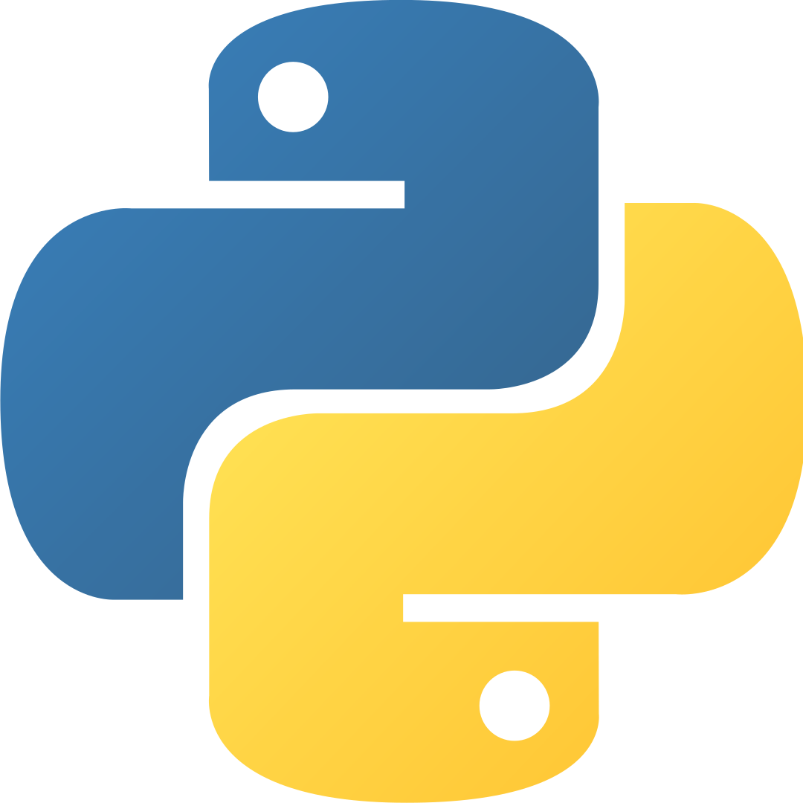

<!--
**YeisonCorrea-dev/YeisonCorrea-dev** is a ✨ _special_ ✨ repository because its `README.md` (this file) appears on your GitHub profile.

Here are some ideas to get you started:

- 🔭 I’m currently working on ...
- 🌱 I’m currently learning ...
- 👯 I’m looking to collaborate on ...
- 🤔 I’m looking for help with ...
- 💬 Ask me about ...
- 📫 How to reach me: ...
- 😄 Pronouns: ...
- ⚡ Fun fact: ...
(url)
-->

 

**Hi, I'm Yeison. I'm a software developer and student of electronic engineering. I like programming because of how  amazing, powerful and entertaining it can be.**

Some of my previous jobs and internships included coding in javascript and others languages.

 &nbsp;
 &nbsp;
 &nbsp; &nbsp;
 &nbsp;
 &nbsp;

-----
